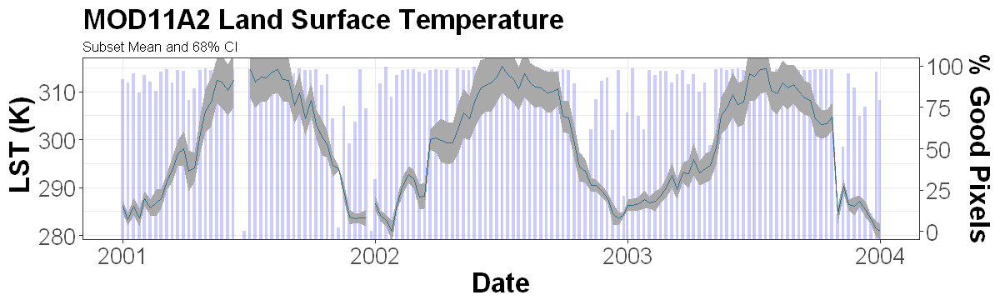

# Access the MODIS web service and perform quality filtering using R

*Author: Jack McNelis*  
*Date: February 27, 2018*  
*Contact for ORNL DAAC: uso@daac.ornl.gov*  

### Keywords: MODIS, web service, R, SOAP

## Overview

The tutorial outlined in the [jupyter notebook](modis_webservice_qc_filter_R.ipynb) will explore using the MODISTools library in R to access MODIS Land Products through a standards based SOAP (Simple Object Access Protocol) Web Service hosted by the ORNL DAAC.

Using the MODIS Web Service users can:

* Retrieve MODIS subsets through command line operations
* Download and integrate subsets directly into client-side workflows
* Download and visualize subsets with customized code  
... and much more.

This tutorial will demonstrate how to do the following in R:

* build a time series of MOD11A2 land surface temperature from multiple web service requests
* format subset responses for easy integration in R workflows
* perform quality control filtering based on MODIS qc criteria

## Source Data

Input data were accessed through the [MODIS Web Service](https://modis.ornl.gov/data/modis_webservice.html) hosted at the ORNL DAAC. All necessary steps for accessing the web service using R are outlined in the [jupyter notebook](modis_webservice_qc_filter_R.ipynb). 

Other methods for accessing data through the web service are described at the MODIS web page; https://modis.ornl.gov. 

## Prerequisites

R (3.x recommended). R libraries: [MODISTools](MODISTools.tar), ggplot2, scales, tidyr

## Procedure

Access the the tutorial here:  
[Tutorial](modis_webservice_qc_filter_R.ipynb)
